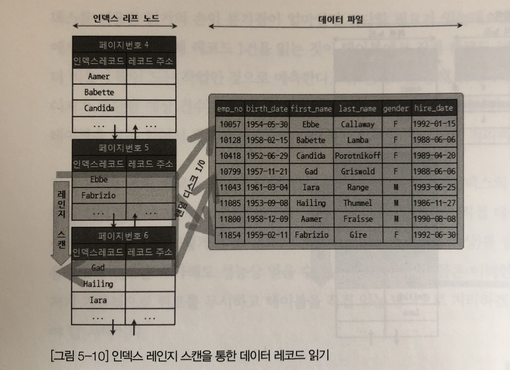
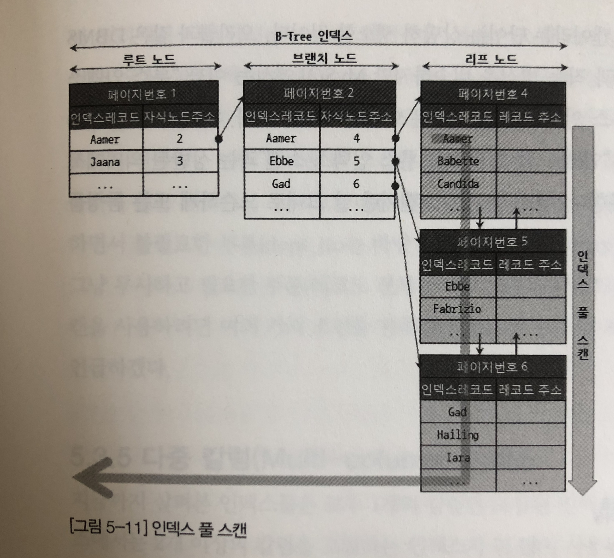
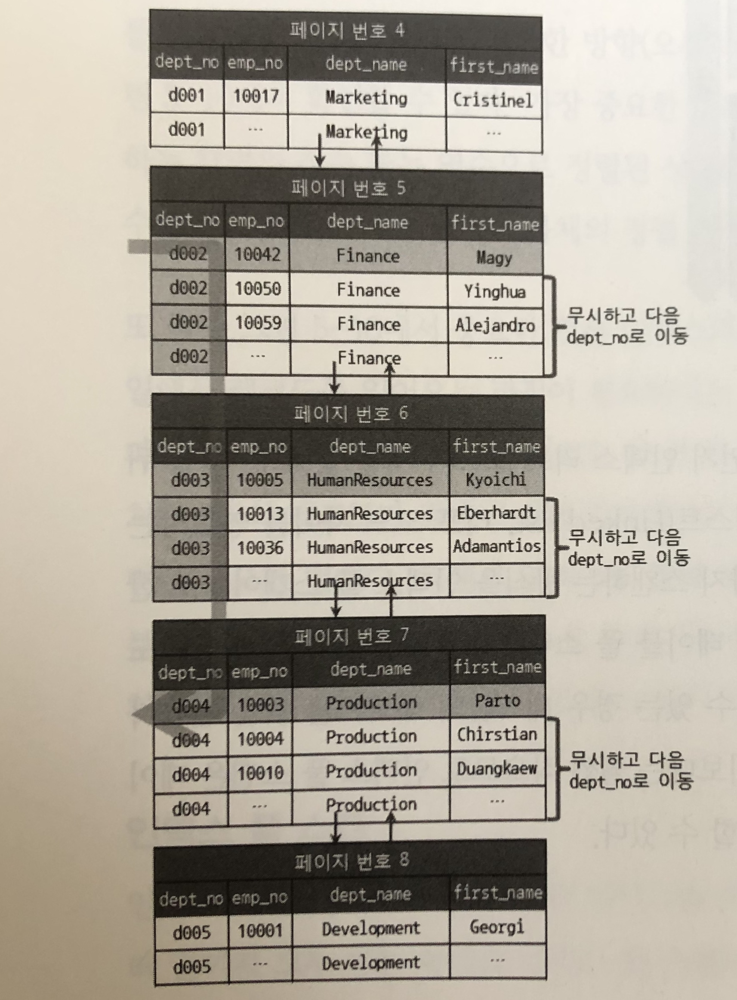

**💌CONTENTS**

- [B-Tree 인덱스 사용에 영향을 미치는 요소](#b-tree-인덱스-사용에-영향을-미치는-요소)
  - [인덱스 키값의 크기](#인덱스-키값의-크기)
  - [B-Tree 깊이](#b-tree-깊이)
  - [선택도(기수성)](#선택도기수성)
  - [읽어야 하는 레코드의 건수](#읽어야-하는-레코드의-건수)
- [B-Tree 인덱스를 통한 데이터 읽기](#b-tree-인덱스를-통한-데이터-읽기)
  - [인덱스 레인지 스캔](#인덱스-레인지-스캔)
  - [인덱스 풀 스캔](#인덱스-풀-스캔)
  - [루스(loose) 인덱스 스캔](#루스loose-인덱스-스캔)

## B-Tree 인덱스 사용에 영향을 미치는 요소

### 인덱스 키값의 크기

- `page`/`block`: InnoDB 스토리지엔진이 디스크에 읽기/쓰기 작업을 하는 최소 단위
  페이지는 InnoDB 스토리지 엔진의 버퍼 풀에서 데이터를 버퍼링하는 기본 단위이기도 하다.

인덱스도 결국 `페이지`로 관리되며, B-Tree의 루트, 브랜치, 리프 노드를 구분한 기분이 바로 페이지 단위이다.
B-Tree는 일반적으로 자식 노드의 개수가 가변적인 구조이며 페이지 크기와 키값의 크기에 따라서 최대 자식노드의 수가 결정된다.

InnoDB의 페이지 크기는 `16KB`로 고정되어 있다. 만약 인덱스의 키가 16바이트이고 자식노드 주소가 평균 12바이트라면, 하나의 인덱스 페이지에는 585개를 저장할 수 있다. (16\*1024/(16+12)) 최종적으로 자식노드를 585개 가질 수 있는 B-Tree가 되는 것이다.

만약 인덱스 키값이 두배로 커진다면 어떻게 될까? 16\*1024/(32+12) = 372 개의 자식노드를 가질 수 있게 된다. 만약 500개 이상의 레코드를 읽어야하는 경우 전자는 인덱스 페이지 한번으로 해결될 수 있지만, 후자는 최소 2번 이상 디스크에서 페이지를 읽어와야 하므로 그만큼 느려질 수 밖에 없다.

페이지 뿐만 아니라 버퍼 풀이나 키캐시 등의 메모리에 캐시해 둘 수 있는 레코드 수가 줄어들기 때문에 메모리의 효율이 떨어지게 된다.

### B-Tree 깊이

B-Tree 인덱스의 깊이는 상당히 중요하지만 직접적으로 제어할 수 있는 방법은 없다.
B-Tree의 깊이는 Mysql에서 값을 검색할 때 몇번이나 랜덤하게 디스크를 읽어야 하는지와 직결되는 문제이다. 인덱스의 키값이 커질수록 하나의 인덱스 페이지에 담을 수 있는 인덱스의 양은 적어지게 되고, 이로 인해 같은 개수의 인덱스라 할지라도 B-Tree의 깊이는 더 깊어져 더 많은 디스크 IO가 발생하게 된다.

depth가 3인 B-Tree에 인덱스를 저장한다고 가정하자.
키값이 16바이트인 경우 최재 2억(585*585*585)개 정도를 저장할 수 있는 반면
키값이 32바이트인 경우 최대 5천만(372*372*372)개를 저장할 수 있다.

실제로는 아무리 대용량 데이터베이스라 하더라도 깊이가 4-5이상 깊어지진 않는다고 한다. 하지만 키값의 크기가 깊이를 좌우한다는 점을 명심하자!

### 선택도(기수성)

모든 인덱스 가운데 유니크한 값의 수를 의미한다.
인덱스 키값 가운데 중복이 적을수록 (선택도가 높을수록) 검색 대상이 줄기 때문에 빠른 검색이 가능하다.

### 읽어야 하는 레코드의 건수

인덱스를 통해 테이블 레코드를 읽는 것은 인덱스를 거치지 않고 바로 테이블의 레코드를 읽는 것 보다 높은 비용이 드는 작업이다.
따라서 테이블 레코드 100만건에 대해서 50만건을 읽어야 하는 쿼리가 있을 때, 전체 테이블을 모두 읽어 필요 없는 50만건을 버리는 것이 빠른지, 인덱스를 통해 필요한 50만건만 읽어오는 것이 효율적일지 판단해야 한다.
일반적인 dbms옵티마이저에서는 인덱스를 통해 레코드 1건을 읽는 것이 테이블에서 직접 읽는 것 보다 4-5배 비용이 더 많이 드는 작업인 것으로 예측한다고 한다. 따라서 인덱스를 통해 읽어야 할 레코드 건수가 전체의 20~25%를 넘으면 테이블을 모두 읽는 것이 더 효율적이다.

## B-Tree 인덱스를 통한 데이터 읽기

어떻게 인덱스를 이용해서 실제 레코드를 읽어내는지 3가지 방법을 알아본다.

### 인덱스 레인지 스캔

인덱스 접근 방법 중 가장 대표적인 방법으로, 아래 두개 방법보다 빠른 방법이다. (그런데 아래의 두가지 방법이 존재하고 사용되는 이유는?)

인덱스 레인지 스캔은 검색해야할 인덱스의 범위가 결정되었을 때 사용하는 방식이다. 루트 노드에서부터 비교를 시작해 최종적으로 리프 노드까지 탖아들어가야 비로소 실제로 원하는 시작 지점을 찾을 수 있다.
이때 리프노드에 저장된 레코드 주소로 데이터 파일의 레코드를 읽어오는데 레코드 한건 단위로 랜덤IO가 한번씩 발생된다.


### 인덱스 풀 스캔

인덱스 레인지 스캔처럼 인덱스를 사용하지만 인덱스 처음부터 끝까지 모두 읽는 방식을 인덱스 풀 스캔이라고 한다. 쿼리 조건절에 사용된 칼럼이 인덱스의 첫번째 칼럼이 아닌 경우 인덱스 풀 스캔 방식이 사용된다. (a,b,c)칼럼 순으로 인덱스가 만들어져 있는데 b나 c칼럼으로 검색하는 경우가 그렇다.



먼저 리프 노드의 제일 앞 또는 뒤로 이동한 후, 리프노드를 연결하는 링크드 리스트를 따라 처음부터 끝가지 스캔하는 방식을 인덱스 풀 스캔이라고 한다.
인덱스 레인지 스캔보단 느리지만 테이블 풀 스캔보다는 효율적이다. 인덱스 전체 크기는 테이블 전체 크기보다 작기 때문이다.

### 루스(loose) 인덱스 스캔

루스 인덱스 스캔이란 말 그대로 듬성듬성하게 인덱스를 읽는 것을 의미한다. 인덱스 레인지 스캔과 비슷하게 작동하지만, 중간중간 필요하지 않은 인덱스 키값은 무시하고 다음으로 넘어가는 방식으로 처리한다. 일반적으로 GROUP BY또는 MAX(), MIN()함수에 대해 최적화를 하는 경우에 사용된다.

```sql
select dept_no, min(emp_no)
from dept_emp
where dept_no between 'd002' and 'd004'
group by dept_no;
```

dept_emp 테이블은 dept_no와 emp_no두개의 칼럼으로 인덱스가 정렬되어 있다.
인덱스에서 where절을 만족하는 범위 전체를 다 스캔할 필요가 없다는 것을 옵티마이저는 알고 있기 때문에 조건에 만족하지 않는 레코드는 무시하고 다음 레코드로 이동한다. 위의 쿼리를 실행하게 되면 dept_no 그룹별로 제일 텃번째 레코드의 emp_no만 읽으면 된다. emp_no가 이미 정렬이 되어있기 때문에 가장 첫 dept_no의 emp_no만 레코드 전체를 읽고 불필요한 부분은 나머지 레코드를 읽지 않고 다음으로 이동하는 것을 볼 수 있다.



참고

- Real MySQL - 이성욱
