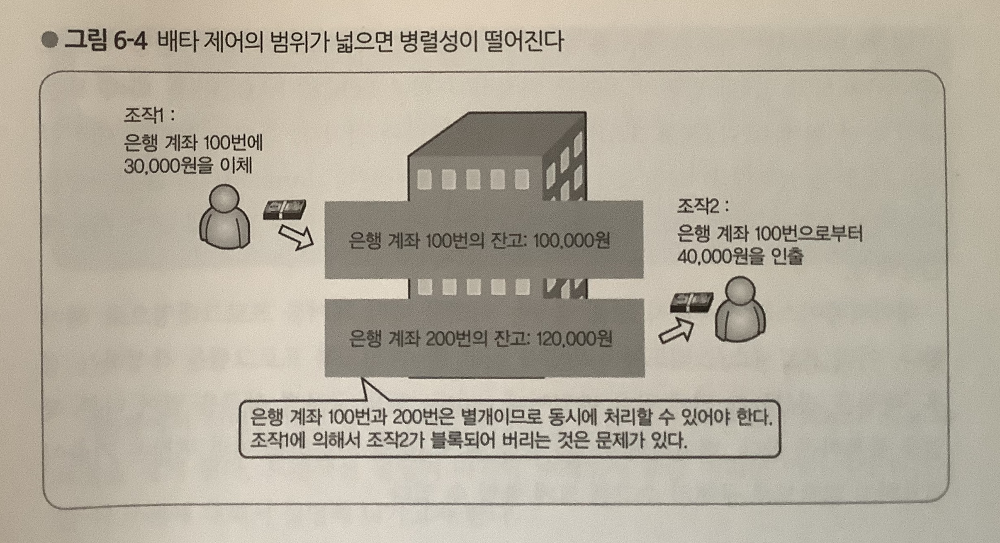

# Lock

Lock이란 `데이터의 일관성`을 보장하기 위한 방법이다.먼저 갱신할 것이 잠금을 확보하고, 다른 트랜잭션에서의 동일한 레코드에 대한 갱신을 방지한다.

멀티 트랜잭션 환경에서 데이터베이스의 일관성과 무결성을 유지하려면 **트랜잭션의 순차적 진행을 보장할 수 있는 직렬화 장치가 필요**하다.예를들어 한 명이 도서관의 좌석을 예약하는 중에 다른 한 명이 같은 좌석을 예약할 수 없게하여 정확히 한 명만 좌석을 배정받을 수 있게 한다.
이런 이유로 이런 기능을 하는 Lock 이라는 기술이 등장했다.

## 잠금의 범위



InnoDB등 현대적인 RDBMS에서 확보하고 있는 잠금의 범위는 `레코드`이다. 테이블 전체 등 넓은 범위에서 잠금을 걸면 관계 없는 레코드도 갱신으로 인해 블록이 되어버려 병렬성이 크게 저하되기 때문이다.

### Shared Lock(공유 lock/ S lock)

- 보통 데이터를 읽을 때 사용한다.
- 리소스를 다른 사용자가 동시에 읽을 수 있게 하되 변경은 불가하게 하는 것이다.
- 어떤 트랜잭션에서 데이터를 읽고자 할 때 다른 shared lock은 허용이 되지만 exclusive lock은 불가하다

=> 어떤 자원에 shared lock이 동시에 여러개 적용될 수 있다.

=> 어떤 자원에 shared lock이 하나라도 걸려있으면 exclusive lock을 걸 수 없다.

### Exclusive Lock(배타적 잠금/ X lock)

- 데이터를 변경할 때 이용한다.
- 어떤 트랜잭션에서 데이터를 변경하고자 할때 해당 트랜잭션이 완료될 때 까지 해당 테이블 또는 레코드를 다른 트랜잭션에서 읽거나 쓰지 못하게 한다.

**=> exclusive lock에 걸리면 shared lock을 걸 수 없다.**

**=> exclusive lock에 걸린 테이블,레코드등의 자원에 대해 다른 트랜잭션이 exclusive lock을 걸 수 없다.**

## 잠금 기간

잠금은 트랜잭션의 종료(커밋 또는 롤백)시 까지 유지된다.

> 잠금은 트랜잭션 명령을 수행할 때만 적용되는 것인가? 일반 쿼리를 날릴땐 적용 안되나?

> MyISAM은 트랜잭션을 지원하지 않기 때문에 일반적으로 sql문의 실행이 끝난 시점에서 잠금이 해제된다. 이 경우 여러 sql문에 걸쳐 잠금을 확보하려하면 곤란을 겪게 된다.

## InnoDB 스토리지 엔진의 잠금

MySQL에서 사용되는 잠금은 크게 `스토리지 엔진 레벨`과 `MySQL엔진 레벨`로 나눌 수 있다.
MySQL엔진은 MySQL서버에서 스토리지 엔진을 제외한 나머지 부분으로 이해하면 되는데, MySQL엔진 레벨의 잠금은 모든 스토리지 엔진에 영향을 미치게 되지만, 스토리지 엔진 레벨의 잠금은 스포리지 엔진 간 상호 영향을 미치지는 않는다.

InnoDB 스토리지 엔진은 MySQL에서 제공하는 잠금과 별개로 스토리지 엔진 내부에서 레코드 기반의 잠금 방식을 탑재하고 있다. InnoDB는 레코드 기반의 잠금 방식 때문에 MyISAM보다 훨 씬 뛰어난 동시성 처리를 제공할 수 있다.

MySQL서버의 INFORMATION_SCHEMA라는데이터베이스에 존재하는 INNODB_TRX, INNODB_LOCKS, INNODB_LOCK_WAITS라는 테이블을 조인해 조회하면 현재 어떤 트랜잭션이 어떤 잠금을 대기하고 있고 해당 잠금을 어느 트랜잭션이 가지고 있는지 확인할 수 있으며, 장시간 잠금을 가지고 있는 클라이언트를 종료시키는 것도 가능하다.

### 잠금 방식

**비관적 잠금(Pessimisitc locking)**

- 현재 트랜잭션에서 변경하고자 하는 레코드에 대해 잠금을 획득하고 변경 작업을 처리하는 방식을 비관적 잠금이라고 한다.
- 현재 변경하고자 하는 레코드를 다른 트랜잭션에서도 변경할 수 있다 라는 비관적 가정을 하기 때문에 먼저 잠금을 획득하는 것이다.
- 일반적으로 높은 동시성 처리에는 비관적 잠금이 유리하다고 알려져 있고 InnoDB는 이 방식을 채택하고 있다.

**낙관적 잠금(Optimistic locking)**

- 기본적으로 각 트랜잭션이 같은 레코드를 변경할 가능성은 상당히 희박할 것이라고 가정한다. 그래서 우선 변경 작업을 수행하고 마지막에 잠금 충돌이 있었는지 확인한다.
- 문제가 있다면 rollback처리를 한다.

### 잠금 종류

1. 레코드 락
   - 레코드 자체만을 잠그는 것을 말한다.
   - 다른 상용 DBMS의 레코드 락과 동일한 역할을 한다. 다만 InnoDB는 레코드 자체가 아니라 인덱스의 레코드를 잠근다는 것이 다르다. InnoDB에서는 대부분 보조 인덱스를 이용한 변경 작업은 넥스트 키 락, 갭 락을 사용하지만, 프라이머리 키 또는 유니크 인덱스에 의한 변경 작업은 갭에 대해서는 잠그지 않고 레코드 자체에 대해서만 락을 건다.
2. 갭 락
   - 레코드 그 자체가 아니라 레코드와 바로 인접한 레코드 사이의 간격만을 잠그는 것을 의미한다.
   - 갭 락의 역할은 레코드 사이의 간격에 새로운 레코드가 INSERT되는 것을 제어하는 것이다.
   - 갭 락은 개념일 뿐, 자체적으로 사용되지 않고 넥스트 키 락의 일부로 사용된다.
3. 넥스트 키 락
   - 레코드 락과 갭 락을 합쳐놓은 형태의 잠금이다.
   - 넥스트 키 락과 갭 락으로 데드락이 발생하는 경우가 많기 때문에 최대한 사용을 줄이는 것이 좋다.
4. Auto increment lock
   - AUTO_INCREMENT 칼럼이 사용된 테이블에 동시에 여러 레코드가 INSERT되는 경우 각 레코드는 중복되지 않고 저장된 순서대로 증가한 일련번호 값을 가져야 한다. InnoDB에서는 이를 위해 내부적으로 AUTO_INCREMENT 락이라고 하는 테이블 수준의 잠금을 사용한다.
   - INSERT나 REPLACE같은쿼리에만 필요하고 나머지 쿼리에서는 걸리지 않는다.
   - 다른 락과 달리 트랜잭션과 관계 없이 INSERT나 REPLACE문장에서 AUTO_INCREMENT 값을 가져오는 순간만 락이 걸렸다가 즉시 해제된다.

### 인덱스와 잠금

앞서 설명했듯이 InnoDB의 잠금은 레코드가 아닌 인덱스를 잠그는 방식으로 처리된다. 즉, 변경해야 할 레코드를 찾기 위해 검색한 인덱스의 레코드를 모두 잠가야 한다.

```sql
-- employees테이블에는 first_name만 멤버로 담긴 ix_firstname 인덱스가 존재.

select count(*) from employees where first_name='Georgi';
-- 253

select count(*) from employees where first_name='Georgi' and last_name='Klassen';
-- 1

update employees set hire_date=now() where first_name='Georgi' and last_name='Klassen';
```

Update문장이 실행되면 1건의 레코드가 업데이트 될 것이다. 하지만 이 1건의 업데이트를 위해 몇개의 레코드에 락을 걸어야 할까?

이 업데이트 문장 조건에서 인덱스를 이용할 수 있는 조건은 first_name뿐이기 때문에 first_name=‘Georgi’인 레코드 253건의 레코드가 모두 잠긴다.

만약 이 테이블에 인덱스가 하나도 없다면 테이블을 풀 스캔 하면서 update작업을 하게 될텐데, 이 과정에서 테이블에 있는 30여만간의 모든 레코드를 잠그게 된다.

이러한 잠금 현상은 InnoDB의 넥스트 키 락 때문에 발생하는 것이다. 바이너리 로그를 비활성화하거난 레코드 기반의 바이너리 로그(Row based binary log)를 사용하는 경우 넥스트 키 락의 사용을 대폭 줄일 수 있다.

## 글로벌 락

글로벌 락은 `FLUSH TABLE WITH READ LOCK` 명령으로만 획득할 수 있으며, MySQL에서 제공하는 잠금 가운데 범위가 가장 크다.
글로벌 락이 영향을 미치는 범위는 MySQL 서버 전체이며, 작업 대상 테이블이나 데이터베이스가 다르다 하더라도 동일하게 영향을 받는다.

일단 한 세션에서 글로벌 락을 획득하면 다른 세션에서 SELECT를 제외한 대부분의 DDL, DML을 실행하는 경우 글로벌 락이 해제될 때 까지 해당 문장이 대기 상태로 남는다.

## 테이블 락

개별 테이블 단위로 설정되는 잠금이다.

## 유저 락

`GET_LOCK()` 함수를 이용해 임의로 잠금을 설정할 수 있다. 이 잠금은 대상이 테이블이나 레코드 또는 `AUTO_INCREMENT`와 같은 데이터베이스 객체가 아니라는 것이다. 유저 락은 단순히 사용자가 지정한 문자열에 대해 획득하고 반납(해제)하는 잠금이다.

---

**참고**

- Real MySQL
- https://jeong-pro.tistory.com/94
- https://suhwan.dev/2019/06/09/transaction-isolation-level-and-lock/
