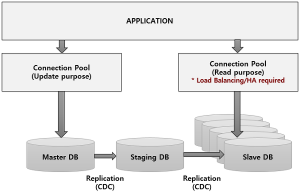

# 샤딩/파티셔닝/레플리케이션

# 쿼리 오프로딩

쿼리 오프로딩은 db의 처리량을 증가시키기 위한 설계 기법이다. 대부분의 db 트랜잭션은 read성이 많기 때문에 update와 read 트랜잭션을 분리하는 것이다.

master DB 에는 쓰기만을 허용하고, master의 내용을 중간에 staging DB에 복사한다. 그리고 이 staging DB는 여러개의 slave DB로 복제한다. 읽기는 slave에서만 수행한다.

쓰기와 읽기 작업을 분리하기 위해서 어플리케이션에서 쓰기와 읽기 로직을 분리해서 구현해야하며, 각기 다른 커넥션을 이용해 접근한다. **일반적으로 application server에서는 이러한 Connection을 ConnectionPool을 이용해서 관리하는데, 읽기 DB의 경우에는 N개의 Slave DB로부터 읽기 때문에, Application이 이 N개의 Slave DB에 대한 요청을 Load Balancing을 해야 합니다.**

또한 특정 slave장애시 다른 slave에 접근할 수 있도록 HA(High Availability) 기능을 제공해야하는데 **Connection Pool 자체에 Load Balancing과 HA 기능을 가지고 있는 Connection Pool을 이용하거나 또는 JDBC Driver와 같이 DBMS용 Driver 자체에 Load Balancing과 HA 기능을 사용합니다.**

**staging DB를 사용하는 이유**

Staging DB는 Slave DB로 복제하기 위한 중간 경우지 역할을 합니다. 다수의 Slave DB로 복제를 해야하기 때문에, 이에 대한 부하가 큽니다. 만약 Master DB에서 Slave DB로 바로 복제를 하게 되면, Master DB가 쓰기 트랜잭션 이외에 복제에 대한 부분을 처리해야 하기 때문에 성능 저하를 유발할 수 있습니다. 이를 방지하기 위해 중간에 Staging DB를 넣는 것입니다.

**Master → Staging → Slave DB로의 복제는 어떤 기술을 이용할까요?**

Source DB에서, insert A,B,C를 하면 이는 모두 Back Log에 기록되고, 이를 읽어서 Target DB에서 다시 replay - insert A,B,C를 순차적으로 수행하는 것입니다.

mysql의 복제는 비동기로 마스터의 데이터가 슬레이브로 전해진다. 따라서 마스터에서 이미 커밋된 데이터라 하더라도 커밋된 시점에 슬레이브에는 그 데이터가 아직 전달되지 않았을 수도 있다.

1. Master 노드에 쓰기 트랜잭션이 수행된다.
2. Master 노드는 데이터를 저장하고 트랜잭션에 대한 로그를 파일에 기록한다.(BIN LOG)
3. Slave 노드의 IO Thread는 Master 노드의 로그 파일(BIN LOG)를 파일(Replay Log)에 복사한다.
4. Slave 노드의 SQL Thread는 파일(Replay Log)를 한 줄씩 읽으며 데이터를 저장한다.

### 장점

- DB 요청의 60~80% 정도가 읽기 작업이기 때문에 Replication만으로도 충분히 성능을 높일 수 있다.
- 비동기 방식으로 운영되어 지연 시간이 거의 없다.

### 단점

- 노드들 간의 데이터 동기화가 보장되지 않아 일관성있는 데이터를 얻지 못할 수 있다.
- Master 노드가 다운되면 복구 및 대처가 까다롭다. (DB 정합성때문에)
- Select를 확장하는 것이지 쓰기를 확장하는 것이 아니다.

쿼리 오프로딩이 레플리케이션?

# 클러스터링

여러개의 DB를 수평적인 구조로 구축하는 방식이다. 클러스터링은 분산 환경을 구성하여 Single point of failure와 같은 문제를 해결할 수 있는 Fail Over 시스템을 구축하기 위해서 사용된다. 클러스터링은 동기 방식으로 노드들 간의 데이터를 동기화하는데, 자세한 처리 방법은 아래와 같다.

위의 그림은 MySQL의 Clustering 방식 中 Galera 방식에 대한 그림이며 자세한 처리 순서는 아래와 같다.

1. 1개의 노드에 쓰기 트랜잭션이 수행되고, COMMIT을 실행한다.
2. 실제 디스크에 내용을 쓰기 전에 다른 노드로 데이터의 복제를 요청한다.
3. 다른 노드에서 복제 요청을 수락했다는 신호(OK)를 보내고, 디스크에 쓰기를 시작한다.
4. 다른 노드로부터 신호(OK)를 받으면 실제 디스크에 데이터를 저장한다.

클러스터링은 DB들 간의 데이터 무결성 검사(데이터가 일치하는지)를 하는 동기방식으로 데이터를 동기화한다.

### 장점

- 노드들 간의 데이터를 동기화하여 항상 일관성있는 데이터를 얻을 수 있다.
- 1개의 노드가 죽어도 다른 노드가 살아 있어 시스템을 계속 장애없이 운영할 수 있다.

### 단점

- 여러 노드들 간의 데이터를 동기화하는 시간이 필요하므로 Replication에 비해 쓰기 성능이 떨어진다.
- 장애가 전파된 경우 처리가 까다로우며, 데이터 동기화에 의해 스케일링에 한계가 있다.

# 샤딩

샤딩은 데이터베이스의 용량 한계를 극복하기 위한 기술이다. 클러스터링 기술을 사용하더라도 DB는 물리적 용량 한계를 갖는 경우가 많다. 샤딩은 쉽게 말해 데이터를 여러개의 DB에 나누어 담는 방법이다.

**하나의 데이터베이스가 10억개의 레코드만 저장할 수 있다면, 100억개의 데이터를 저장하려면 10개의 데이터베이스를 사용하여 분산 저장하는 방법입니다. 이 각 10개의 데이터베이스를 Shard라고 합니다.**

### **Vertical Partitioning**

- 도메인에 따라 쉽게 분리할 수 있습니다.
- 도메인에 영향을 많이 받기 때문에 대부분 `application level`에서 CRUD를 구현합니다.

**샤딩(Sharding)**

- 같은 테이블 스키마를 가진 데이터를 다수의 데이터베이스에 분산하여 저장하는 방법을 의미합니다.
- `application level`에서도 가능하지만 **database level**에서도 가능합니다.
- `Horizontal Partitioning`이라고 볼 수 있습니다.

## 모듈러샤딩/레인지 샤딩

모듈러 샤딩은 pk를 모듈러 연산한 결과로 DB를 특정하는 방식이다.

- 장점: 레인지 샤딩에 비해 데이터가 균일하게 분산
- 단점: DB를 추가 증설하는 과정에서 이미 적재된 데이터의 재정렬이 필요함

모듈러샤딩은 데이터량이 일정 수준에서 유지될 것으로 예상되는 데이터 성격을 가진 곳에 적용할 때 어울리는 방식입니다. 물론 데이터가 꾸준히 늘어날 수 있는 경우라도 적재속도가 그리 빠르지 않다면 모듈러방식을 통해 분산처리하는 것도 고려해볼 법 합니다. 무엇보다 데이터가 균일하게 분산된다는 점은 트래픽을 안정적으로 소화하면서도 DB리소스를 최대한 활용할 수 있는 방법이기 때문입니다.

레인지 샤딩은 PK의 범위를 기준으로 디비를 특정하는 방식이다.

- 장점: 모듈러 샤딩에 비해 증설에 재정렬 비용이 들지 않음
- 단점: 일부 디비에 데이터가 몰릴 수 있음

데이터가 급격히 증가할 여지가 있다면 레인지방식도 좋은 선택일겁니다. 다만 단점을 무시할 수 없는데요. 주로 활성유저가 몰린 DB로 트래픽이나 데이터량이 몰릴 수 있기 때문입니다. 기껏 분산처리를 했는데 이런 상황이 발생하면 또다시 부하분산을 위해 해당 DB를 쪼개 재정렬하는 작업이 필요하고, 반대로 트래픽이 저조한 DB는 통합작업을 통해 유지비용을 아끼도록 관리해야 합니다.

### 한계점

- 두 개 이상의 샤드에 대한 JOIN 연산을 할 수 없다.
- auto increment 등은 샤드 별로 달라질 수 있다.
- last_insert_id() 값은 유효하지 않다.
- shard key column 값은 update하면 안된다.
- 하나의 트랜잭션에서 두 개 이상의 샤드에 접근할 수 없다.

### 샤딩 적용시 문제점들 및 고려사항

3.1 데이터 재분배 ( Rebalancing data )

Sharding된 DB의 물리적인 용량한계나 성능한계에 다르면 shard의 수를 늘리는 scale-up 작업이 필요하다. 서비스 정지 없이 scale-up 할수 있도록 설계방향을 잡아야 한다.

3.2 샤딩으로부터 데이터 조인하기 ( Joining data from multiple shards )

Sharding-db 간에 조인이 불가능 하기에 처음부터 역정규화를 어느정도 감수해야 한다. Shard의 목정이 대용량 데이터 처리이므로, 대용량처리시 수행성능을 위해서 데이터 중복은 trade-off 관계 임을 이미 알고 있다.

3.3 샤드에 데이터를 파티션하는 방법 ( How do you partition your data in shards? )

shard 해쉬함수를 잘 설계해야 한다.

3.4 샤드간의 트랜잭션 문제

Global Transaction을 사용하면 shard DB간의 트랜잭션도 가능하다. 그 유명한 XA인데, 성능저하의 문제가 있다.

3.5 Global Unique Key

DBMS 에서 제공하는 auto-increament를 사용하면 key가 중복될수 있기 때문에, application 레벨에서 Key 생성을 담당해야 한다.

3.6 데이터는 작게

Table의 단위를 가능한 작게 만들어야 한다.

---

참고

[[대용량DB] Sharding & Query Off Loading](https://12bme.tistory.com/372?category=739626)

[https://mangkyu.tistory.com/97](https://mangkyu.tistory.com/97)

[https://seokbeomkim.github.io/posts/partition-and-sharding/#파티셔닝partitioning](https://seokbeomkim.github.io/posts/partition-and-sharding/#%ED%8C%8C%ED%8B%B0%EC%85%94%EB%8B%9Dpartitioning)

[https://hanburn.tistory.com/106](https://hanburn.tistory.com/106)
