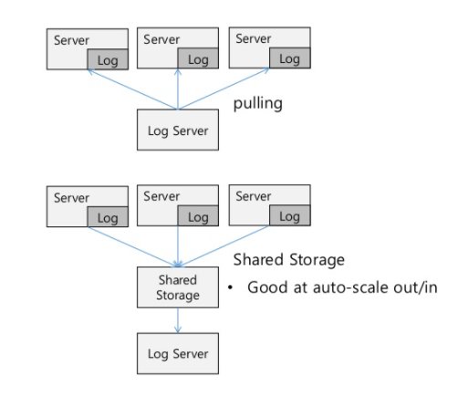
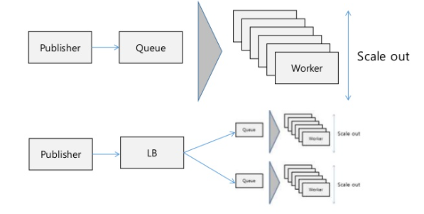
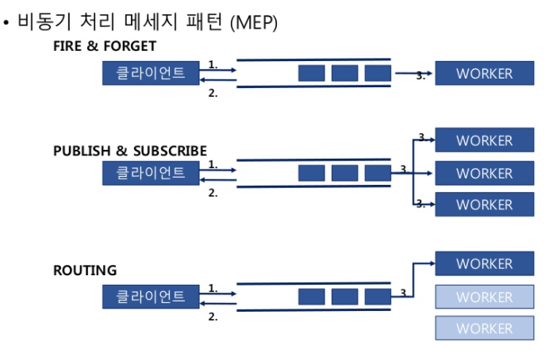
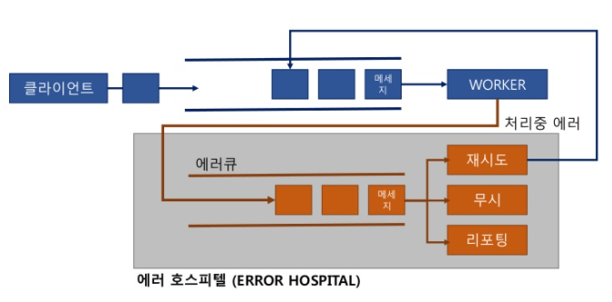

### 분산 아키텍쳐 디자인 패턴

- 서비스 지향적 (SOA)
  - loosely coupled
  - 기능을 api로 제공
  - 공통 서비스
  - 컴포넌트화
- Redundant&Resilience

  - redundant
    - 이중화
    - 비싼 고가용성 서버, 클러스터링, 엔터프라이즈
    - 트랜잭션을 깨지지 않고 보장
  - resilience
    - 장애나면 빠르게 복구
    - 트랜잭션이 깨짐. 대용량 서비스에서 비용을 낮추다보니 장애가 남. 장애 나는 것을 전재로 하고 고가용에 들어가는 비용 낮춤

- 파티셔닝(샤딩)
  - 데이터를 여러 db에 나눠 저장
  - 수평적 샤딩(10대,20대,30대)/ 수직적 샤딩(사용자db, 컨텐츠 db, 댓글 db)
  - 데이터 쏠림에 주의
  - 검색 어려움(별도 인덱스 서버 고려)
  - 일반적으로 어플리케이션 차원에서 분산 처리
- Query off loading
  - 읽기와 쓰기를 분리
  - 마스터 노드: 쓰기 중심
  - 슬레이브 노드: 읽기 중심(무한 확장 가능)
  - 중간에 스테이징 db를 놓는 방법 고려
  - 어플리케이션에서 분리되서 구현되어야 함.
    
- 캐싱
  
- 부하분산(로드밸런싱)
  - 알고리즘
    - hash
    - RR
  - l4, l7, Reverse Proxy(Nginx), `ELB`
- CDN
  - 정적 컨텐츠를 지역적으로 분산된 엣지 노드에 배포
  - css, html 압축, webP변환 등 지능형 기술 보유
  - `Cloud Front`
- ADN
  - 압축 전송: Riverbed
  - 전용망 서비스: aws cloud connects
  - 클라우드 리전에 프록시 서버를 넣어도 유사 효과
- 로깅

  - 글로벌 트랜잭션과 로컬 트랜잭션
  - apm이나 로깅 서비스 사용도 좋다

    

    - 분산 로깅

      - pulling
      - shared storage

        

    - 로깅 계층
      - 시스템 로깅(ELK)
      - 이벤트 로깅(Sentry)
      - 모바일 로깅(Flurry)

- 비동기 패턴

  - 대용량 트랜잭션 처리에 유리.
  - 메세지 큐를 기반함. 응답을 기다리지 않고 바로 리턴. 큐 뒤에 다수의 워커가 메세지를 읽어 처리(워커 수를 조정해 대용량 처리 용이)
  - 큐 자체에 대한 파티셔닝(또는 대용량 큐 ex. 카프카)을 고려

    
    

    - 비동기 에러처리

      - 재처리: aging 필요
      - 무시
      - 리포팅(수동 처리)

        

출처

- https://www.slideshare.net/Byungwook/4-61487454
- https://www.slideshare.net/awskr/aws-77399815
