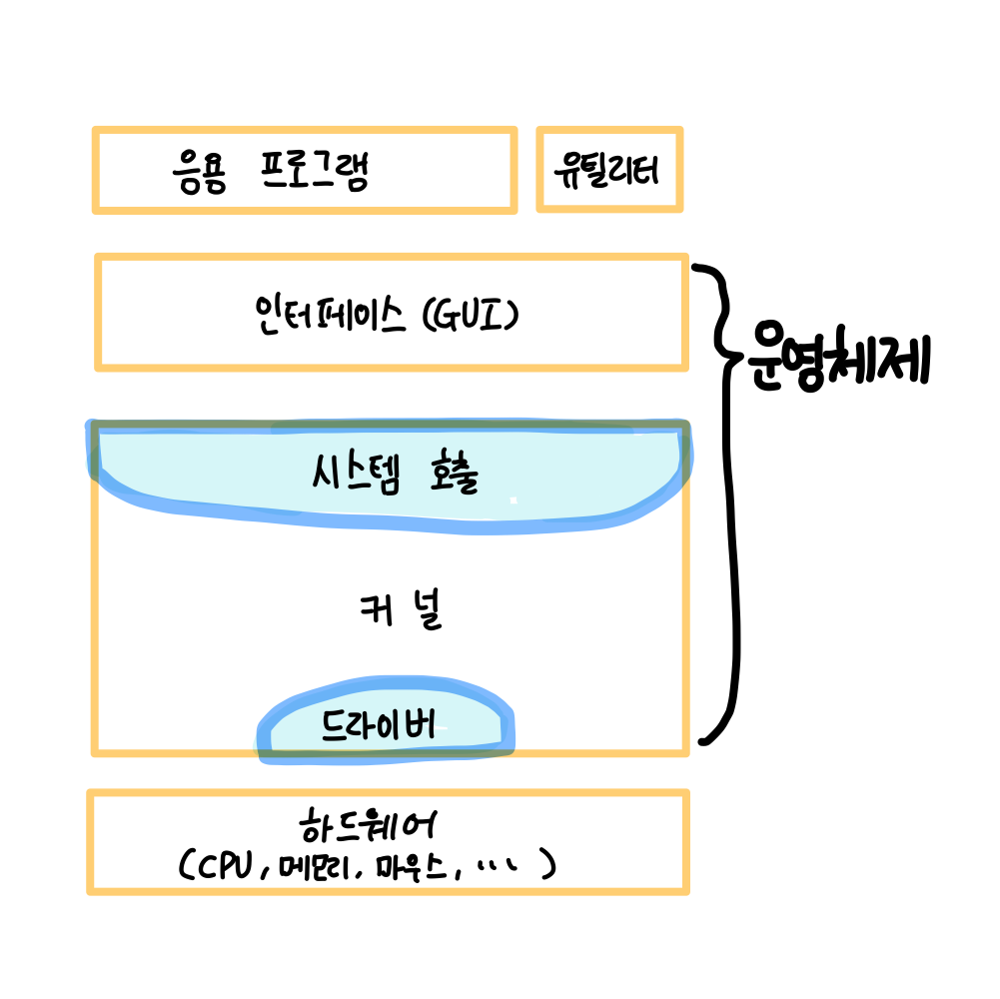

## 운영체제란

- 하드웨어와 사용자(와 각종 소프트웨어) 사이를 연결하는 소프트웨어 계층이다.
- 사용자에게 편리한 인터페이스 환경을 제공하고 컴퓨터 시스템의 자원을 효율적으로 관리하는 시스템

운영체제도 소프트웨어이기 때문에 컴퓨터 전원이 켜지면 메모리에 운영체제를 올리는 작업을 한다.
하지만 운영체제의 크기는 매우 크기 때문에 핵심적인 부분만 먼저 올리고 나머지 소프트웨어는 필요할 때 메모리에 올려서 사용한다.
전원이 들어오고 부터 메모리에 항상 올려져 있는 운영체제를 `커널`이라고 한다.

### 운영체제의 역할

1. 컴퓨터의 자원(cpu, 메모리, 하드 디스크, 소프트웨어 자원)을 효율적으로 관리하는 역할
2. 자원 보호

- 운영체제는 사용자가 직접 자원에 접근하는 것을 막음으로써 자원을 보호하고 관리한다. 운영체제는 사용자와 응용프로그램에게 모든 자원을 숨긴다.

3. 사용자 인터페이스 제공

- 사용자는 운영체제가 숨긴 자원을 인터페이스를 통해 요청할 수 있다.
- 인터페이스는 사용자 인터페이스와 하드웨어 인터페이스가 있다.

## 운영체제 구조

운영체제는 사용자와 응용프로그램에 인접하여 **커널에 명령을 전달하고 실행 결과를 사용자와 응용 프로그램에 전달**하는 `인터페이스`와 **운영체제의 핵심 기능**을 모아놓은 `커널`로 구성된다.

운영체제는 커널과 인터페이스를 분리하여 같은 커널을 사용하더라도 다른 인터페이스를 사용할 수 있다. (ex. OS X)

## 커널

커널은 프로세스 관리, 메모리 관리, 저장장치 관리와 같은 운영체제의 핵심기능을 모아놓은 것으로, 자동차에 비유하면 엔진 같은 것이다.

커널 내부에는 시스템 호출과 드라이버가 있다.

### 시스템 호출

- 커널이 자신을 보호하기 위해 만든 인터페이스다.
- 커널이 제공하는 시스템 자원 관련 서비스를 모아놓은 것이며 함수 형태로 제공된다.
- 시스템 호출을 하면 사용자 모드에서 커널 모드로 바뀐다.

응용프로그램이나 사용자가 운영체제를 통해 자원을 이용하기 위해서는 이 시스템 호출이라는 인터페이스를 통해 접근해야 한다.

**시스템 호출 유형**

1. 프로세스 제어
   - 끝내기(end), 중지(abort)
   - 적재(load), 실행(execute)
   - 프로세스 생성(create process)
   - 프로세스 속성 획득과 설정(get process attribute and set process attribute)
   - 시간 대기(wait time) 사건 대기(wait event)
   - 사건을 알림(signal event)
   - 메모리 할당 및 해제 : malloc, free
2. 파일 조작
   - 파일 생성(create file), 파일 삭제(delete file)
   - 열기(open), 닫기(close)
   - 읽기(read), 쓰기(write), 위치 변경(reposition)
   - 파일 속성 획득 및 설정(get file attribute and set file attribute)
3. 장치 관리
   - 장치를 요구(request devices), 장치를 방출release device)
   - 읽기, 쓰기, 위치 변경
   - 장치 속성 획득, 장치 속성 설정
   - 장치의 논리적 부착(attach) 또는 분리(detach)
4. 정보 유지
   - 시간과 날짜의 설정과 획득(time)
   - 시스템 데이터의 설정과 획득(date)
   - 프로세스 파일, 장치 속성의 획득 및 설정
5. 통신
   - 통신 연결의 생성, 제거
   - 메시지의 송신, 수신
   - 상태 정보 전달
   - 원격 장치의 부착 및 분리

 

### 드라이버

**응용 프로그램 - 커널** 과의 인터페이스가 `시스템 콜`이라면

**응용 프로그램 - 하드웨어** 의 인터페이스는 `드라이버` 이다.

커널은 입출력의 기본적인 부분만 제작하고, 하드웨어의 특성을 반영한 소프트웨어(디바이스 드라이버)를 하드웨어 제작자에게 받아 커널이 실행될 때 함께 실행되도록 한다. 간단한 드라이버는 커널에 포함되어 있고(마우스, 키보드) 복잡한건 따로 설치해야 한다.(프린터)

> 위의 운영체제 그림을 보면 시스템 호출 부분은 커널 앞부분 전체를 감싸고 있는 반면 드라이버쪽은 일부만 감싸고 있음을 볼 수 있다.
>
> 이것은 사용자와 응용 프로그램은 시스템 콜을 거치지 않고는 커널에 진입할 수 없지만, 하드웨어는 커널과 직접 연결될 수 있기도 하고 드라이버를 이용해 연결될 수 있다는 것을 의미한다.

### 커널이 하는 일

| 기능                  | 설명                                                             |
| --------------------- | ---------------------------------------------------------------- |
| 프로세스 관리         | 프로세스에 CPU를 배분하고 작업에 필요한 제반 환경을 제공         |
| 메모리 관리           | 프로제스에 작업 공간을 배치하고 실제 메모리보다 큰 가상공간 제공 |
| 파일 시스템 관리      | 데이터를 저장하고 접근할 수 있는 인터페이스 제공                 |
| 입출력 관리           | 필요한 입력과 출력 서비스 제공                                   |
| 프로세스 간 통신 관리 | 공동 작업을 위한 각 프로세스간 통신 환경 지원                    |
