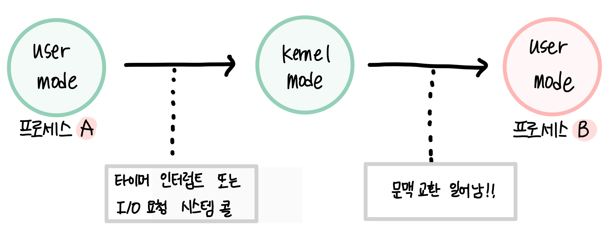
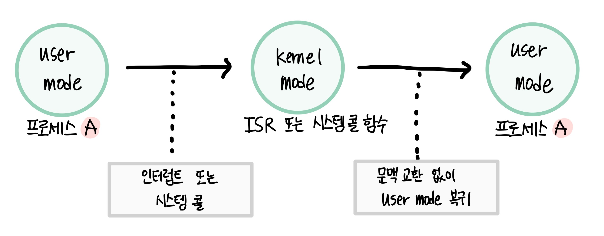

**💌CONTENTS**

- [프로세스](#프로세스)
  - [프로세스 구조](#프로세스-구조)
    - [커널 프로세스 / 사용자 프로세스](#커널-프로세스-/-사용자-프로세스)
  - [프로세스 상태](#프로세스-상태)
  - [PCB(Process Control Block)](#pcbprocess-control-block)
    - [PCB에 저장되는 내용들](#pcb에-저장되는-내용들)
  - [문맥 교환(Context Switching)](#문맥-교환context-switching)
  - [프로세스 생성과 복사](#프로세스-생성과-복사)
    - [fork() 시스템 콜](#fork-시스템-콜)
  - [IPC(Inter-process Communication)](#ipcinter-process-communication)
    - [1. 메세지 전달(Messaging Passing)](#1.-메세지-전달messaging-passing)
    - [2. 공유 메모리(Shared Memory)](#2.-공유-메모리shared-memory)
  - [프로세스와 프로그램](#프로세스와-프로그램)

# 프로세스

**현재 실행중인 프로그램**으로 운영체제로부터 주소공간, 파일, 메모리 등을 할당받는다.
`코드`, `데이터`, `스택`으로 구성되는 독자적인 주소 공간을 갖는다.
사용자가 프로그램을 실행하면 운영체제는 프로그램을 메모리로 가져와 `코드 영역`에 넣고 `PCB`를 생성한다. 그리고 메모리에 `데이터 영역`과 `스택 영역`을 확보한 후 프로세스를 실행한다.

> 프로그램을 실행시킬 때 프로세스로 실행하는 이유는?

## 프로세스 구조

| 프로세스    | 예시                                       | 설명                                                                                                         |
| ----------- | ------------------------------------------ | ------------------------------------------------------------------------------------------------------------ |
| 코드 영역   | 워드프로세서 프로그램                      | 프로세스의 본문이 기술되어있다. (read-only)                                                                  |
| 데이터 영역 | 워드프로세서로 편집중인 문서               | 코드가 실행되면서 사용하는 변수나 파일등의 데이터를 저장하는 곳.   일반 데이터 영역과 힙영역이 존재한다. |
| 스택영역    | os가 워드 작동을 위해 사용하는 부가 데이터 | 운영체제가 프로세스를 실행하기 위해 부수적으로 필요한 데이터를 모아놓은 곳.                                  |

### 커널 프로세스 / 사용자 프로세스

## 프로세스 상태

**new**: 프로세스가 시작되어 그 프로세스를 위한 자료구조는 생성되었으나 아직 메모리를 획득하지 못한 상태. PCB가 생성된다.

**ready**: 프로세스가 CPU만 보유하면 당장 명령을 실행할 수 있는 상태.
생성된 프로세스가 CPU를 얻을 때 까지 기다리는 상태. 자기 실행 순서가 될 때 까지 준비 상태에서 기다려야 한다. (CPU가 하나인 컴퓨터에서는 한번에 하나의 프로세스만 실행)

**running**: 프로세스가 CPU를 보유하고 기계어 명령을 실행하고 있는 상태. 일정시간동안 CPU를 사용할 권리를 갖는다. 주어진 시간동안 작업이 끝나지 않았다면 다시 준비 상태로 돌아간다.

**wait**: 프로세스에게 CPU를 주어도 당장 명령을 실행할 수 없는 상태

**terminated**: 프로세스가 종료되었으나 운영체제가 해당 프로세스와 관련된 자료구조를 완전히 정리하지 못한 상태

## PCB(Process Control Block)

운영체제가 시스템 내의 프로세스들을 관리하기 위해 프로세스마다 유지하는 정보들을 담는 커널 내 자료구조. 커널 주소공간의 data 영역에 존재한다.

### PCB에 저장되는 내용들

- process 상태
  - CPU를 할당해도 되는지 여부를 결정하기 위해 필요함.
  - 생성, 준비, 실행, 대기, 보류 준비, 보류 대기
- pc값
  - 다음에 수행할 명령어의 위치를 가리킨다
- CPU 레지스터 정보
  - 이전에 실행할 때 사용한 레지스터 값을 보관해야 다음에 실행할 수 있기 때문에 자신이 사용하던 레지스터의 중간값을 저장.
- CPU 스케줄링 정보
- 메모리 관리 정보
  - 프로세스가 메모리 어디에 위치해 있는지 나타내는 메모리 위치 정보
  - 메모리 보호를 위한 경계 레지스터 값, 한계 레지스터 값
  - 세그멘테이션 테이블, 페이지 테이블
- 자원 사용 정보
- 입출력 상태 정보
- 포인터
  - 준비/대기 큐를 구현할 때 PCB의 포인터를 사용한다.
- 등등

> ❓ 그래서, 프로세스마다 Context가 필요한 이유는 무엇일까?

그 이유는 바로 `문맥교환`이 일어나기 때문이다.

문맥 교환중에 CPU를 선점하고 있던 프로세스는 프로세스 문맥을 자신의 PCB에 저장하게 되고,

새롭게 CPU를 할당받을 프로세스는 PCB로부터 예전에 저장했던 자신의 문맥을 실제 하드웨어로 복원시키는 과정을 거치게 된다.

 

## 문맥 교환(Context Switching)

문맥 교환이란 하나의 사용자 프로세스로부터 **다른 사용자 프로세스로** CPU의 제어권이 이양되는 과정을 말한다.

 

실행 상태에 있던 프로세스(A)가 입출력을 요청해야하는 경우가 생겼다고 가정해보자.

입출력을 하기 위해서 프로세스는 I/O를 요청하는 시스템 콜을 발생시키고, 프로세스는 device queue에 줄을 서게 되고 준비 상태로 상태가 변경된다.

> 시스템 콜을 발생시킨다 = 프로세스는 커널 밖에 있는 응용 프로그램?

그리고 준비 큐에 있던 다른 프로세스(B)가 CPU를 할당받아 명령을 수행하게 될 것이다.

이렇게 프로세스A에게 있던 CPU제어권이 프로세스B에게로 넘어가는 과정을 `문맥 교환`이라고 한다.

> 시스템콜이나 인터럽트로 인해 CPU제어권이 운영체제로 넘어가는 경우에도 프로세스 문맥 중 일부를 PCB에 저장하기는 하지만 이 과정을 문맥 교환이라고 하지는 않는다.
>
> CPU를 점유하는 프로세스가 바뀐것이 아니라 단지 실행 모드만 바뀌는 것 뿐이기 때문이다. 이와 같은 모드 변경에 비해 문맥 교환은 훨씬 많은 오버헤드가 뒤따른다.

 

**문맥 교환이 일어나는 경우**

- 타이머 인터럽트 발생
- 프로세스가 입출력 요청 시스템 콜을 하여 봉쇄 상태에 들어가는 경우

**문맥 교환이 일어나지 않는 경우**

- 그밖의 인터럽트나 시스템 콜 발생시 (프로세스가 교체되는 것이 아니라 `모드`만 변경되는 경우)

 

문맥 교환에 소요되는 시간은 시스템 입장에서 볼 때 일종의 `오버헤드`라고 할 수 있다. 따라서 타이머 인터럽트 시간을 너무 짧게하면 프로세스간 문맥 교환이 너무 자주 일어나 오버헤드가 커지게 된다.

## 프로세스 생성과 복사

### fork() 시스템 콜

시스템이 부팅된 후 최초의 프로세스는 운영체제가 직접 생성하지만, 그 다음부터는 이미 존재하는 프로세스를 fork() 시스템콜을 사용해 `복제`하여 프로세스를 생성한다.

> 새로운 워드 프로그램을 하나 더 실행하면 운영체제는 새로운 워드 프로그램을 실행하는 것이 아니라 fork() 시스템콜을 이용해 기존의 워드 프로세스를 복사한다.

**복제된 자식 프로세스는 프로세스 식별자를 제외하고 부모 프로세스와 똑같은 문맥을 가지게 된다.** 주소공간, 레지스터 상태, PCB, 커널 스택 등 모든 문맥이 똑같다.

따라서 자식 프로세스를 생성하는 것은 부모가 아이를 낳는 것이 아니라 **부모와 똑같은 나이, 똑같은 기억을 가지고 있는 복제 인간을 만드는 것과 같다.**

부모 프로세스는 자신이 생성했던 모든 후손 프로세스들이 먼저 죽어야 본인이 종료될 수 있다. 부모 프로세스는 자식 프로세스를 강제로 종료시킬수도 있고, 자식 프로세스가 종료될 때 까지 `wait`상태로 기다릴수도 있다.

## IPC(Inter-process Communication)

하나의 컴퓨터 안에서 실행중인 **서로 다른 프로세스간에** 발생하는 통신을 말한다.

원래 프로세스는 각각 `독립적인 주소공간`을 가지고 수행되고 서로의 주소공간을 참조할 수 없다. 하지만 프로세스간 통신을 통해 정보의 공유 등의 이점이 있어 프로세스간 협력 메커니즘이 생겼다.

### 1. 메세지 전달(Messaging Passing)

`커널`을 통해 메세지를 전달, 수신하는 방법이다.
통신을 원하는 프로세스간에 `커뮤니케이션 링크`를 생성한 후 send(), receive()를 이용해 메세지를 주고받는다. 공유변수를 사용하지 않는다.

**종류**

- 직접 통신: 통신하려는 프로세스에게 직접 메세지를 전송한다.
- 간접 통신: 메세지를 메일박스 또는 포트로부터 전송받는다.

### 2. 공유 메모리(Shared Memory)

프로세스들이 메모리의 주소 공간의 일부를 공유하게 된다.
공유 메모리의 `동기화`를 보장해주어야 한다.

## 프로세스와 프로그램

프로그램은 하드같은 저장장치에 보관되어 있다가 마우스로 더블클릭하면 실행된다. 폰노이만 구조에서 프로그램이 실행된다는 것은 해당 코드가 메모리에 올라와 작업이 진행된다는 것이다.

프로그램은 저장장치에 저장되어 있는 정적인 상태이고, 프로세스는 실행을 위해 메모리에 올라온(PCB가 생성된) 동적인 상태이다.

메모장을 2개 켜놓는다고 가정하면 메모장 실행파일이 프로그램, 메모장을 실행해 켜진 두개의 메모장이 프로세스이다. 메모장 프로그램을 실행시켜 2개의 프로세스를 만든 것이다.

- 프로세스 = 프로그램 + PCB
- 프로그램 = 프로세스 - PCB

`운영체제`도 프로그램이기 때문에 프로세스 형태로 실행되어야 한다.
컴퓨터 전원을 켰을 때 부트스트랩이 운영체제 프로세스를 메모리에 올리게 된다. 따라서 컴퓨터에는 일반 사용자의 `사용자 프로세스`와 운영체제의 `커널 프로세스`가 섞여 실행된다.
